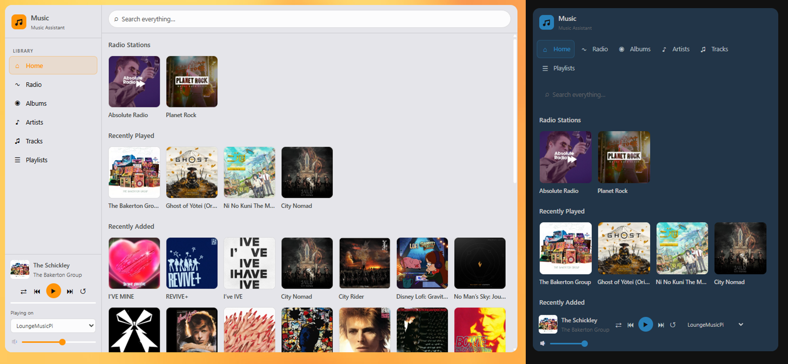

# MA Browser Card

A Music Assistant browser card for Home Assistant. Browse your music library - albums, artists, tracks, playlists and radio stations - with full artwork, search, queue view and playback controls, all within a single Lovelace card. This has been tested when your own media such as a Plex server is linked. I haven't tested it with all providers.
 


# Disclaimer
 **Use at your own risk.** This is a personal project shared freely with the community. It is not affiliated with, endorsed by, or supported by Music Assistant or Nabu Casa. I make no guarantees about stability, accuracy or fitness for any particular purpose, and take no responsibility for anything that may go wrong as a result of using it. Always back up your Home Assistant configuration before installing custom components.

## Features

- Browse up to 500 albums, artists, tracks, playlists and radio stations
- Global search across your entire library from any view
- Favourited radio stations from Music Assistant
- Recently played, recently added and discover sections on the home screen (MA token required)
- Click any album or track to play immediately
- Right-click for Play now / Shuffle play / Play next / Add to queue
- Full queue view with artwork - click the now-playing artwork to open (MA token required)
- Shuffle and repeat controls
- Volume slider
- Album art with loaded as needed - no performance impact on large libraries
- Library caching for instant navigation after first load
- Adjustable sidebar size and layout
- Fits to your theme
- Party mode for queueing up tracks

## Requirements

- [Home Assistant](https://www.home-assistant.io/) with [HACS](https://hacs.xyz/)
- [Music Assistant](https://music-assistant.io/) server (v2.8+)
- Music Assistant Home Assistant integration installed

## Installation via HACS

1. Open HACS in Home Assistant
2. Go to **Frontend**
3. Click **⋮** → **Custom Repositories**
4. Add `https://github.com/PMizz13/ma-browser-card` as a **Dashboard** repository
5. Find **MA Browser Card** in the list and click **Download**
6. Restart Home Assistant

## Manual Installation

1. Download `ma-browser-card.js` from the [latest release](https://github.com/PMizz13/ma-browser-card/releases/latest)
2. Copy it to `/config/www/ma-browser-card.js` on your HA instance
3. In HA go to **Settings → Dashboards → ⋮ → Resources → Add Resource**
   - URL: `/local/ma-browser-card.js`
   - Type: **JavaScript Module**
4. Reload the browser

## Configuration

Making any configuration changes may require a frontend cache reset to repopulate the data correctly. I am working on a fix for this to make it easier.

### Finding your `config_entry_id`

Go to **Settings → Devices & Services → Music Assistant → Configure**. Look at the URL in your browser, it will contain something like
config_entry=01JNBHFPQSJY03ANJ6XXF053W2. That string is your `config_entry_id`.

### Setting Your Width
Create a grid card with 1 column (or multiple if desired) and place this card inside it. This is the easiest way to control how wide you want the card to be.

### Getting an MA access token (optional)

The `ma_token` is only needed for the **Recently Played** section on the home screen. Without it everything else works fine.

1. Open the Music Assistant UI
2. Click the profile icon (top right)
3. Go to **Access Tokens**
4. Create a new token and copy it

### Minimal config

```yaml
type: custom:ma-browser-card
config_entry_id: 01JNBHFPQSJY03ANJ6XXF053W2
ma_url: http://192.168.1.x:8095
```

### Full config

```yaml
type: custom:ma-browser-card
config_entry_id: 01JNBHFPQSJY03ANJ6XXF053W2
ma_url: http://192.168.1.x:8095
ma_token: eyJ...               # Optional — enables Recently Played and Recently Addes sections
height: 580                    # Card height in pixels (default: 580)
players:                       # Optional — limit to specific MA players
  - media_player.kitchen_speaker    # If omitted, auto-detects all MA players
  - media_player.living_room
theme: auto                     # auto (default, copies dashboard theme), dark, light
sidebar_position: left          # left (default) or top (horizontal nav bar)
sidebar_width: 195              # Sidebar width in px, left sidebar only (default: 195)
player_position: bottom         # bottom (default) or top
show_title: true                # Show/hide the logo title bar (default: true)
title: Music                    # Logo title text (default: Music)
subtitle: Music Assistant       # Logo subtitle text (default: Music Assistant)
icon: mdi:music                 # Any MDI icon for the logo (default: mdi:music)
click_action: play              # play (default) or enqueue
```

### Config options

| Option            | Required | Default | Description                                                      |
| ----------------- | -------- | ------- | ---------------------------------------------------------------- |
|**Functionality**  |          |         |                                                                  |
| `config_entry_id` | Yes      | -       | Your MA integration config entry ID                              |
| `ma_url`          | Yes      | -       | URL of your MA server, e.g. `http://192.168.1.x:8095`            |
| `ma_token`        | No       | -       | MA access token — enables Recently Played and Recently Added     |
| `players`         | No       | all     | List of `media_player` entity IDs to show in the player selector |
| `click_action`    | No       | play    | What to do when media is clicked (play, enqueue)                 |
|**Layout**         |          |         |                                                                  |
| `height`          | No       | `580`   | Card height in pixels                                            |
| `sidebar_position`| No       | left    | Set position of sidebar (left, top)                              |
| `sidebar_width`   | No       | 195     | Set the sidebar width when positioned to the left in pixels      |
| `player_position` | No       | bottom  | Position the player to the bottom or top                         |
| **Appearance**    |          |         |                                                                  |
| `title`           | No       | Music   | Text for title card                                              |
| `subtitle`        | No       | Music Assistant | Subtitle for card                                        |
| `icon`            | No       | mdi:music | Icon for card (any mdi)                                        |
| `theme`           | No       | auto    | Theme for card, (dark, light, auto (use Home Assistant theme))   |
## Usage

### Browsing
Use the sidebar to navigate between Home, Saved Radio, Albums, Artists, Tracks and Playlists.

### Playing
- **Click** any album, radio station or track to play it on the selected player (or enqueue if set)
- **Right-click** (or long-press on mobile) for more options: Play now, Shuffle play, Play next, Add to queue

### Search
Type in the search bar at the top to search across Albums, Artists, Tracks, Radio and Playlists simultaneously. Use the Play all and Shuffle all buttons that appear in each search result section in addition to the standard controls.

### Queue
Click the now-playing artwork or track title in the sidebar to open the full queue view. It shows the last 3 played tracks and all upcoming tracks with artwork.

### Player selector
Use the dropdown in the sidebar to switch between MA players. The volume slider and playback controls all apply to the selected player.

## Notes

- The `ma_token` is stored in plaintext in your Lovelace config. Treat it like a password — don't share your dashboard YAML publicly if it contains your token.
- Library browsing loads up to 500 items per section for performance. Search covers your full library regardless of this limit.
- The card uses a WebSocket connection directly to your MA server for Recently Played, Recently added and the queue view. This requires `ma_url` and `ma_token` to be set.
- There is a hidden scroll bar in the media view section for use with a mouse or trackpad without a scroll feature, just click on the right side of the pane where you would expect a scroll bar to usually be and it will show up

## Troubleshooting

**No players showing in the dropdown**
Add a `players:` list to your config with the exact entity IDs from Developer Tools → States.

**No artwork showing**
Check that your MA server is reachable at the `ma_url` you configured. Artwork is fetched directly from MA.

**Recently Played section missing**
Add `ma_token` to your config. Without it the section is skipped silently.
If this is in the card yaml then reset the cache. This will need to be done when changing dashboard themes currently.

**Recently Played section not changing**
A known bug in Music Assistant where certain players do not track played tracks. You will need to wait on a fix from Music Assistant.

**Card not loading**
Check the browser console (F12) for errors. Make sure the resource is registered as a JavaScript Module (not a regular JS file).

## Credits

Built using the [Music Assistant](https://music-assistant.io/) WebSocket and HA service APIs.
